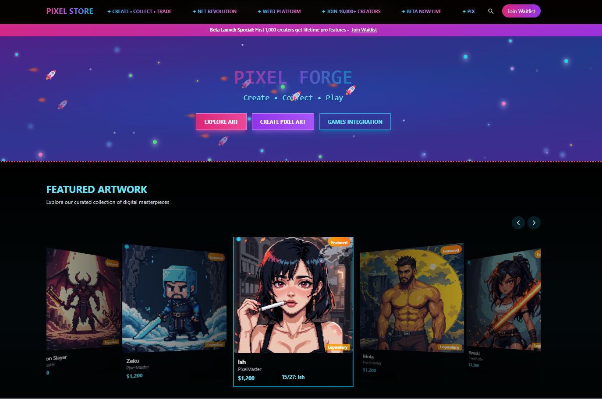

# Pixel Forge NFT

> A full-stack NFT marketplace where users can create pixel art, connect their crypto wallet, and interact with a live blockchain-ready platform.

### [Live Demo → pixelforge-nft.vercel.app](https://pixelforge-nft.vercel.app)

---

## What It Does

Pixel Forge NFT is a full-stack marketplace demo that brings together Web3 and creative tooling in one place:

- **Pixel Art Creator** — in-browser drawing tool to design and mint original NFT artwork
- **MetaMask Integration** — connect your wallet and interact with the Ethereum ecosystem
- **Authentication System** — secure sign-in with NextAuth, backed by a real database
- **NFT Marketplace UI** — browse, list, and explore NFT collections with a modern responsive interface

---

## Tech Stack

| Layer | Technology |
|---|---|
| Frontend | Next.js 15, React, TypeScript, Tailwind CSS |
| Backend | Next.js API Routes, Prisma ORM |
| Database | PostgreSQL |
| Auth | NextAuth.js |
| Web3 | MetaMask, Ethereum |
| Deployment | Vercel |

---

## Screenshot



---

## Key Features

- **Pixel art canvas** built from scratch in the browser
- **MetaMask wallet** connect and authentication
- **Full auth system** with session management via NextAuth
- **Persistent data** via Prisma + PostgreSQL
- **Fully responsive** UI with Tailwind CSS
- **Next.js 15 App Router** with server components

---

## Running Locally

```bash
# Install dependencies
npm install

# Set up environment variables
cp .env.example .env.local

# Push database schema
npx prisma db push

# Start development server
npm run dev
```

Open [http://localhost:3000](http://localhost:3000) in your browser.

---

*Built as a portfolio project to demonstrate full-stack and Web3 development skills.*